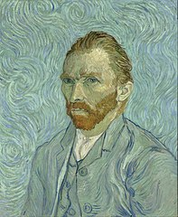

.. _rozdzial1:

Malarswo Vincenta Van Gogha
===========================

Autoportret
----------------------------

Opis
----

Obraz przedstawia popiersie artysty. Jest on ubrany w marynarkę, a nie w kurtkę, w której zwykle pracował.
Uwaga widza skupia się na wychudłej i nieruchomej twarzy artysty, o wyrazistych rysach.
Z twarzy tej można odczytać wstrząsające przeżycia niedawnej przeszłości, pomimo że van Gogh napisał do brata,
iż z „ogromnym trudem namalował siebie spokojnego”.
W przeciwieństwie do kilku autoportretów namalowanych po dużym kryzysie w grudniu 1888 tu pokazał lewą, nie zranioną część twarzy.
Obwiedzione zielonym kolorem oczy artysty wydają się być nieustępliwe i pełne niepokoju.
Dobrze przemyślana jest konstrukcja obrazu: artysta stopniowo intensyfikuje kolorowe,
falujące linie przechodząc od białego niuansu koszuli poprzez marynarkę i głowę aż do śmiałych spirali z tyłu, na ścianie.
Dominującym na obrazie kolorem jest absyntowa zieleń i jasny błękit marynarki i tła skontrastowane z ostrym oranżem brody i włosów ,
ten sam kolor został użyty dla przedstawienia zarówno wirującego tła, jak i ubioru artysty.
W tym morzu błękitu jego głowa, umieszczona w centrum obrazu, jawi się niczym ikona.

   Autoportret

