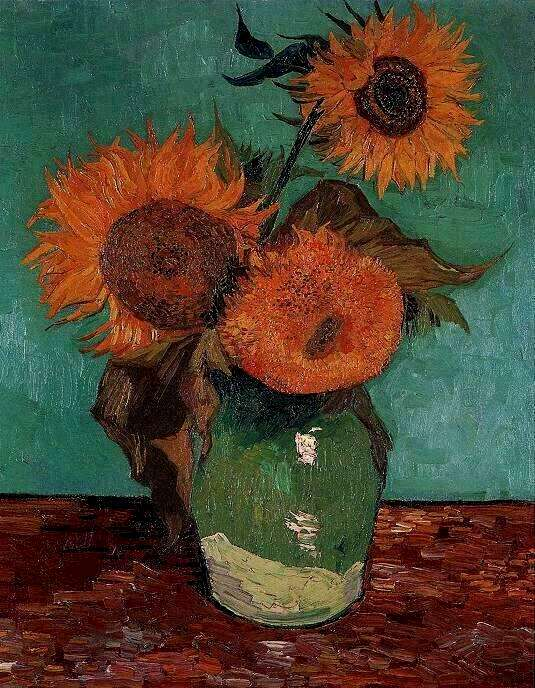

.. _rozdzial3:

Malarswo Vincenta Van Gogha
===========================

Słoneczniki
-----------

Opis
----

Obraz „Słoneczniki” to jedno z najbardziej znanych dzieł malarskich na świecie. 
Powstało w 1888 roku. Obraz ma 95 cm wysokości i 73 szerokości.
Oryginał można podziwiać w muzeum malarza w Amsterdamie. 
W centralnej części obrazu znajduje sie wazon ze słonecznikami, które zajmują znaczna przestrzeń. 
Słoneczniki  tworzą bukiet, niektóre z nich mają dłuższe łodygi i zwisają ku dołowi. 
Na obrazie dominują ciepłe kolory, różne odcienie żółci, koloru pomarańczowego i brązowego.  
Tło jest niebieskie, a blat stoł, na którym postawiono wazon mocno żółty.
Słoneczniki wydają się lekkie, delikatne, choć w rzeczywistości to dość duże, masywne kwiaty.

